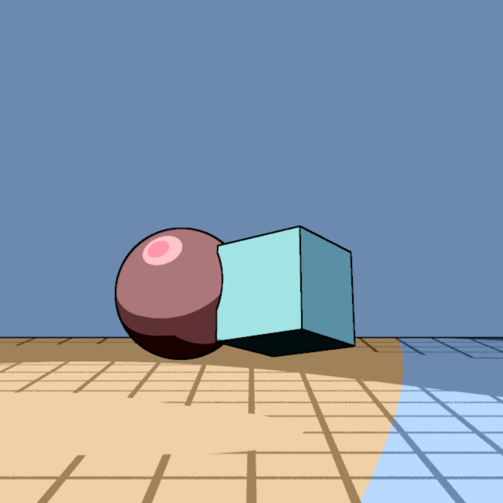

# Cel shading projekat

Cel shading (poznat i kao toon shading) je tehnika koja renderovanoj slici daje izgled kao da je nacrtana.
Umesto glatkih prelaza, boje se grupišu u nekoliko ravnih nijansi, a oblici se
obrube tamnim linijama, pa rezultat liči na crtani film.



Ovaj projekat za predmet Računarska Grafika 2 dodaje takav efekat u GfxLab, kao
post-process nad gotovom slikom.

```
                           ┌───────────────┐
                           │     Scene     │
                           └───────┬───────┘
                   ┌───────────────┴───────────────┐
                   ▼                               ▼
           ┌───────────────┐               ┌───────────────┐
           │  EAggregator  │               │   RenderOnce  │
           │     Color     │               │ Normal, Depth │
           └───────┬───────┘               └───────┬───────┘
                   │                               │
  ┌────────────────┼───────────────────────────────┼────────────────┐
  │                │          CelShader3           │                │
  │                ▼                               ▼                │
  │        ┌───────────────┐               ┌───────────────┐        │
  │        │ kvantizacija  │               │  Sobel ivice  │        │
  │        │    (OkHCL)    │               │ depth, normal │        │
  │        └───────┬───────┘               └───────┬───────┘        │
  │                │                               │                │
  │                └───────────────┬───────────────┘                │
  └────────────────────────────────┼────────────────────────────────┘
                                   │
                                   ▼
                           ┌───────────────┐
                           │   cel slika   │
                           └───────────────┘
```

## Kako radi

Shader prima tri prolaza:

1. **Color**: RayTracerSimple kroz normalni agregator. Jedini
   prolaz koji se usrednjava po sampleovima, kao i svaki drugi render (što je za boju
   i potrebno).
2. **Normal**: [RayTracerNormal](src/xyz/marsavic/gfxlab/graphics3d/raytracers/RayTracerNormal.java)
   kroz RenderOnce. Prvi hit, normala u toj tački spakovana u RGB kao `(n+1)/2`. Iz
   nje se hvataju pregibi unutar istog objekta, tamo gde se površina savija, a silueta
   ostaje ista.
3. **Depth**: [RayTracerDepth](src/xyz/marsavic/gfxlab/graphics3d/raytracers/RayTracerDepth.java)
   kroz RenderOnce. Prvi hit, rastojanje do tačke skalirano u `[0,1]`. Iz njega se
   hvataju siluete i mesta gde jedan objekat zaklanja drugi.

U agregatoru ima smisla usrednjavati samo boju. Za normale i dubinu nam
treba stanje površine tačno u centru piksela, pa za njih ide zaseban
prolaz van agregatora koji vraća samo prvi hit.

## Shader

Pošto ivicama trebaju i susedni pikseli, detekcija ne može da ide kroz
ColorTransform, koji radi piksel po piksel. Zato
[CelShader3](src/xyz/marsavic/gfxlab/tonemapping/CelShader3.java) stoji na mestu
ToneMapping3 u pipelineu i prima sve prolaze i color transform istog tipa kao
ToneMapping2 (AutoSoft).
Po pikselu radi dve stvari: kvantizuje boju i dodaje ivice.

### Kvantizacija

Kvantizacija se radi posle color transforma (HDR u LDR), jer kvantizacija sirovih
HDR vrednosti ne bi imala smisla.

Kvantizacija je u OkHCL modelu, koji je perceptualno približno uniforman, pa su
granice traka raspoređene bliže tome kako ih ljudsko oko vidi. Sve tri komponente
(lightness, chroma, hue) se kvantizuju isto: `bandify` zaokruži vrednost na centar
njene trake (`floor(v*n)`, clampovano, pa `(band+0.5)/n`). U demou ih je 4 za
lightness, 3 za chroma i 12 za hue.

Chroma je jedina komponenta bez prirodne gornje granice. Lightness ide od 0 (crna)
do 1 (bela), a hue je ugao normalizovan na `[0,1]` (turnova); chroma zavisi od boje i za sve
što sRGB može da prikaže ide do otprilike 0.32. (OkLab se ovde računa direktno iz
linear sRGB, u kom Color i čuva vrednosti). Zato se pre kvantizacije deli sa konstantom
`OKHCL_CHROMA_NORM` (0.4) da padne u `[0,1]`, kvantizuje se,
pa se magnituda vrati množenjem.

Posle kvantizacije neke boje ispadnu van sRGB opsega, jer sRGB ima nepravilan oblik
unutar OkLab prostora. Zato se rezultat na kraju clampuje po kanalu (`clampTo01()`).

### Ivice

Ivice dolaze iz Sobel filtera (3x3, X i Y kernel) puštenog na oba bafera:

- **Depth** ivica: hvata siluete i mesta gde jedan objekat zaklanja drugi. Jedan kanal (grayscale).
- **Normal** ivica: hvata pregibe unutar jednog objekta gde se površina savija (a
  depth se ne menja nužno). Pušta se na sva tri kanala RGB i kombinuje kao `sqrt(gr^2 + gg^2 + gb^2)`.

Njih dve se kombinuju kao `max(normalEdge, depthEdge * depthEdgeScale)`.
`depthEdgeScale` (u demou 3.0) pojačava depth ivice pre poređenja, pa siluete dobijaju
prioritet nad pregibima i spoljne konture ispadaju čistije.

Ako bi se za jačinu ivice koristio klasičan threshold, rezultat bi imao nazubljene linije
debljine jednog piksela. Umesto toga, težina ivice prolazi kroz `smoothstep(0.5*edgeThreshold, 1.5*edgeThreshold, e)`, koja glatko raste oko praga (u demou 0.3) i time sama omekša liniju. Finalna boja je `banded * (1 - outlineWeight)`: na punoj ivici ide u crno, na delimičnoj se samo potamni.

### Anti-aliasing

Anti-aliasing dolazi iz dve stvari:

- **Supersampling.** Svaki prolaz se renderuje na `supersample` puta veću rezoluciju
  od izlaza (demo: 2x), pa shader po izlaznom pikselu uprosečava `s*s` hi-res
  piksela. I Sobel koristi `supersample` kao veličinu svog koraka, da bi čitao susede na hi-res
  razmaku.
- Već pomenuti **smoothstep** na konturama.